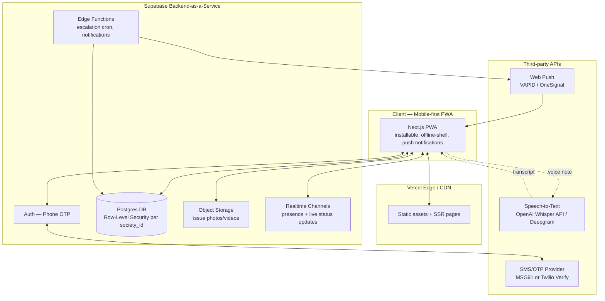
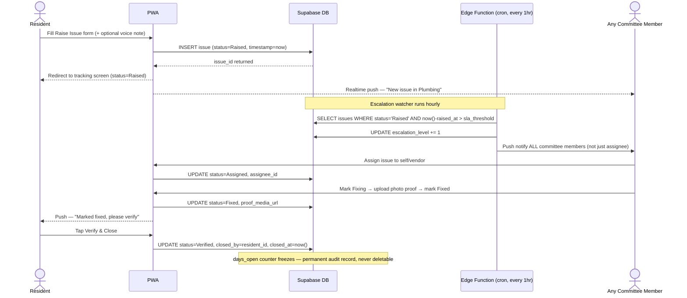
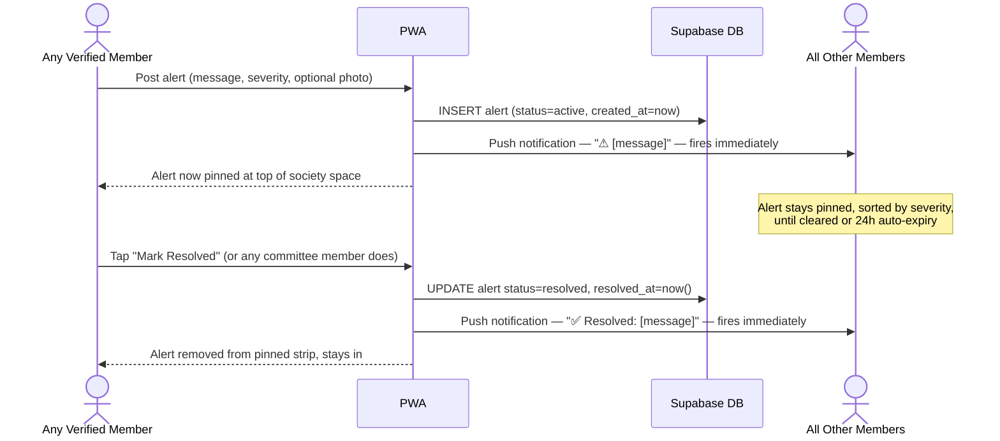
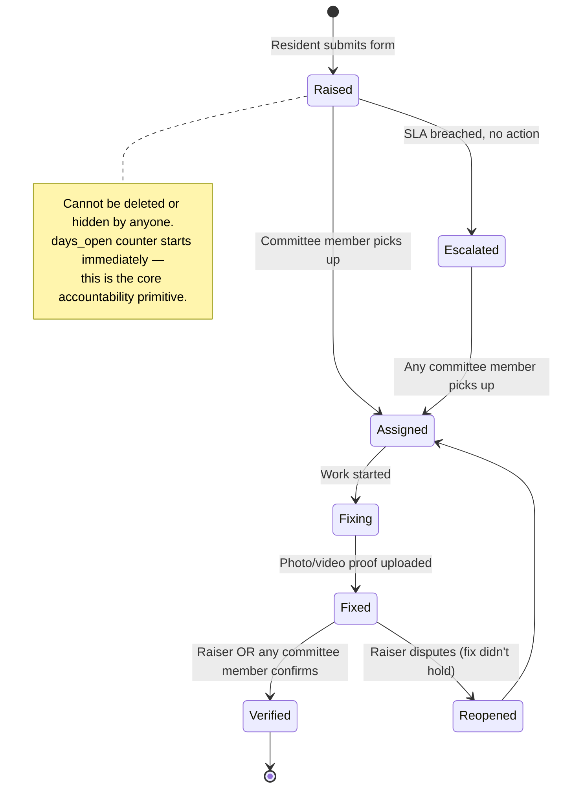
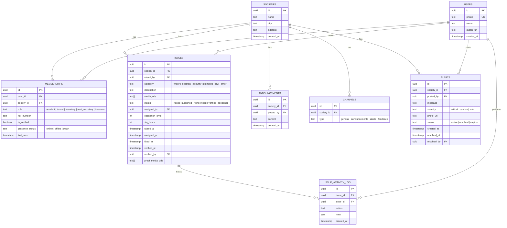

# [Society App] — Master Build Document
**Verified society issue-tracking & accountability platform, built like the apps people already use**

---

## 0. Product Thesis (locked from ideation)

- **Not** a WhatsApp clone. Not a Jira clone. A single unit that borrows familiar *patterns* from apps people already use daily, so zero learning curve is required.
- **v1 priority order:** (1) issue intake that can't be silently ignored, (2) full issue tracking pipeline, (3) peer-escalation on delay. Governance/financial-transparency features are v2.
- **Core insight from real complaint research:** the secretary/committee is often the source of the problem, not just the fixer. The product must make silence and delay *visible by default*, without requiring the committee's cooperation to exist.
- **Platform:** Pure web app (mobile-first, PWA-enabled). **No forced download, ever.** A resident gets a link or scans a QR code, it opens straight in their mobile browser, signs up, and uses it immediately — exactly like opening any website. "Add to Home Screen" is offered later as an *optional* convenience (so it feels app-like on repeat visits), never a requirement to access or use the product. Native app wrapper only much later, if/when traction justifies app-store presence.
- **Builder for v1:** one person, part-time, AI-assisted coding.

---

## 1. UX Structure — Where Each Familiar App Pattern Comes From

| Screen / Pattern | Borrowed from | Why |
|---|---|---|
| Home screen = list of "Society Spaces" you belong to | WhatsApp chat list | Everyone already scans a vertical list of "rooms" daily. Zero teaching needed. |
| Inside a society = left sidebar of channels (General, Announcements, Raise Issue, Feedback) | Discord server sidebar | Segments issue-tracking from casual chat without new mental model. |
| Member list with online/offline dot, tap-to-expand | Discord member list + WhatsApp "last seen" | Presence is a familiar, trusted signal — reuse it, don't reinvent it. |
| The issue **status tracker screen** | **Swiggy / Zomato / Amazon order tracking**, not Jira | This is the single most important UI decision. Every Indian smartphone user already reads "Order Placed → Preparing → Out for Delivery → Delivered" without thinking. Map issue status to this exact visual pattern (vertical stepper, filled circles, timestamps, live pulse on active step) instead of a Jira board. Jira/kanban is unfamiliar to a 60-year-old committee treasurer; a delivery tracker is not. |
| Raise Issue form | Kept deliberately un-borrowed | Single column, one section at a time, large tap targets, camera-first image upload. No inspiration needed here — simple beats familiar for a one-time-per-issue form. |
| Pinned short-lived info (construction, snake spotted, power/water outage) | WhatsApp "pinned message" + Discord's pinned-posts bar | A thin, always-visible strip above the channel feed — short-lived, severity-colored, dismissible by the poster once resolved. |
| "..." overflow menu (Hall booking, Marketplace, Feedback, Settings) | WhatsApp group's "..." / Instagram's "..." | Buries secondary features so the primary screen stays minimal. |
| Notifications | WhatsApp push notification style, grouped by society | Familiar red-badge-count mental model. |

### Screen map

```
[Home] — list of societies (WhatsApp chat-list style)
   └── [Society Space] — top bar: society name + member avatars
         ├── Pinned Info Strip (always visible at top, above every channel) → shows active
         │     short alerts sorted by severity (🔴 critical / 🟠 caution / ⚪ info),
         │     tap to expand full list
         ├── Left Sidebar (Discord-style channels)
         │     ├── # general        → casual text feed (optional, can ship later)
         │     ├── # announcements  → committee → all, one-way formal broadcast
         │     ├── 📌 alerts         → short-lived community info (see Section 1b below)
         │     ├── ⚠ raise-issue    → PRIMARY — opens issue list (card feed, not chat)
         │     └── 💬 feedback       → structured feedback, category-tagged
         ├── Right/slide-in panel — Members list (online green dot / offline grey, role badge: Secretary/Treasurer/Resident/Tenant)
         └── "..." overflow (top right) → Hall Booking, Marketplace/Classifieds, My Profile, Settings

[Raise Issue Form] (opens as full-screen page from the ⚠ channel's "+ New Issue" button)
   → Category (chip select: Water / Electrical / Security / Plumbing / Civil / Other)
   → Description (short text field, optional 🎤 mic button → voice-to-text)
   → Image upload — two clear options on one button group: [📷 Take Photo] [🖼 Upload from Gallery]
        - multiple images allowed, shown as small thumbnails with a remove (×) option before submit
   → Auto-filled: name, flat number, phone (from profile, not re-typed)
   → Submit → routes straight into:

[Issue Tracking Screen] (Swiggy/Amazon-style vertical stepper)
   ● Raised           [timestamp]           ← always filled, cannot be un-filled
       — uploaded images shown here as a thumbnail gallery (tap to view full-size),
         visible to the raiser, the assignee, and all committee members reviewing it
   ○ Assigned         [pending / timestamp]
   ○ Fixing           [pending / timestamp]
   ○ Fixed (+ photo proof required to advance — fixer's photo/video also shown in-line, same gallery pattern)
   ○ Verified & Closed [only raiser OR any committee member can tap this]
   — "3 days since raised, no action" banner appears in RED once SLA breached, visible to ALL committee members (peer-escalation trigger)
```

### 1a. On "feels like an app but runs in the browser"

No download step, no app store, no forced install. The flow is: **link or QR code → opens in the phone's browser → sign up with phone number → using it immediately.** Every screen described above is a normal web page. The only thing that makes it *feel* like an app is design (full-screen layouts, no visible browser chrome once loaded, bottom tab bar instead of desktop-style navigation, instant transitions) — not a technical requirement to install anything. A QR code poster in the society's lobby or lift is enough distribution for the pilot; no Play Store listing needed at this stage.

### 1b. Alerts / Pinned Info — short-lived community broadcasts

This is distinct from the issue-tracking pipeline on purpose. Not everything needs a status workflow — "snake spotted in Block B" doesn't get "Assigned/Fixed/Verified," it just needs to be seen by everyone, then cleared when it's no longer relevant.

**How it works:**
- Any verified member can post a short alert (one line, optional single photo) — e.g. *"No electricity in Block A, expected back by 6 PM"*, *"Snake spotted near Block B garden"*, *"Water tanker delayed, low pressure till evening"*.
- At posting, they pick a **severity**: 🔴 Critical (safety — snake, fire, security threat), 🟠 Caution (utility disruption — no power/water, construction noise), ⚪ Info (general FYI — event, notice).
- The alert immediately becomes **pinned** at the top of the society space, above all channels, visible the moment anyone opens the app — sorted with 🔴 critical always on top.
- **Notification fires immediately when posted** — push notification to all members: *"⚠ [Society] — No electricity in Block A"*.
- The original poster (or any committee member) can mark it **Resolved/Cleared** — e.g. once electricity is back. This removes it from the pinned strip and **fires a second notification**: *"✅ [Society] — Electricity restored in Block A"*.
- Alerts auto-expire after 24 hours if never manually cleared, so stale pins don't clutter the strip forever — but they still log to history (visible in the # alerts channel feed) even after they leave the pinned strip.

---

## 2. System Architecture Diagram



---

## 3. Data Flow — Raising, Escalating, and Closing an Issue



---

## 3b. Data Flow — Posting and Clearing an Alert



---

## 4. Issue State Machine



---

## 5. Database Schema (Entity-Relationship)



**Image handling note:** `ISSUES.media_urls` holds an array — support multiple images per issue, not just one. Images are uploaded to Supabase Storage from either the device camera or gallery picker (standard HTML `<input type="file" accept="image/*" capture="environment">` gives the "take photo or choose from gallery" browser prompt automatically — no custom camera UI needed for v1). On the tracking screen, render `media_urls` (the raiser's images) and `proof_media_urls` (the fixer's proof images) as separate thumbnail galleries, tap-to-zoom, so anyone reviewing the issue — raiser, assignee, or any committee member — sees exactly what was reported and exactly what was fixed, side by side.

**Design rule that matters most:** `ISSUE_ACTIVITY_LOG` is **append-only** — enforce this with a Postgres rule/trigger that blocks `UPDATE` and `DELETE` on that table entirely. This is what makes "unignorable" actually true instead of a UI promise. Every status change, every assignment, every comment writes a permanent row here. The `ISSUES` table shows current state; the log is the audit trail nobody — not even a Secretary with admin access — can quietly edit.

---

## 6. Voice-to-Text / Auto-Fill Design

**Flow:** Resident taps 🎤 on the description field → records up to ~60 seconds → audio blob uploaded to Supabase Storage → sent to a Speech-to-Text API → transcript returned and dropped into the text field → resident can edit before submitting.

**API options (get keys from):**
| Provider | Where to get it | Notes |
|---|---|---|
| **OpenAI Whisper API** (`whisper-1` or newer) | https://platform.openai.com/api-keys | Best accuracy for Indian-accented English + Hindi mix (Hinglish), cheap per-minute, simplest integration (one REST call). Recommended for MVP. |
| **Deepgram** | https://deepgram.com | Faster/cheaper at higher volume, good streaming support if you want live transcription later. Evaluate at scale, not MVP. |
| **Browser-native Web Speech API** | No key needed — built into Chrome | Free, zero backend cost, but inconsistent across browsers/devices and weaker on Indian regional accents. Fine as a fallback, not the primary path. |

For v1: call OpenAI Whisper server-side (never expose the API key client-side) from a small Supabase Edge Function that receives the audio blob and returns text.

**Auto-fill (name, flat number, phone):** this needs no AI at all — pull directly from the `MEMBERSHIPS` row tied to the logged-in user's session. Don't over-engineer this part.

---

## 7. Full API/Service List — What You Need and Where to Get It

| Need | Service | Get it at | Free tier? |
|---|---|---|---|
| Database + Auth + Storage + Realtime | Supabase | https://supabase.com | Yes, generous for pilot scale |
| Hosting (frontend) | Vercel | https://vercel.com | Yes |
| Phone OTP (India-compliant, DLT-registered) | MSG91 | https://msg91.com | Paid, cheap per-SMS — Twilio's SMS to Indian numbers has DLT/regulatory friction, MSG91 is the standard India-first choice |
| Voice-to-text | OpenAI API | https://platform.openai.com | Pay-per-use, cheap at pilot volume |
| Push notifications (web) | Web Push (VAPID keys, self-generated) or OneSignal | https://onesignal.com (optional, easier setup) | Yes, free tier |
| Image compression before upload | `browser-image-compression` npm package | Built into your code, no external service | Free |
| Error tracking (recommended once live) | Sentry | https://sentry.io | Yes, free tier |

---

## 8. Repo / Folder Structure

```
society-app/
├── app/                          # Next.js App Router
│   ├── (auth)/
│   │   └── login/page.tsx
│   ├── (main)/
│   │   ├── page.tsx              # Home — society list
│   │   └── society/[id]/
│   │       ├── layout.tsx        # sidebar + member panel shell
│   │       ├── general/page.tsx
│   │       ├── announcements/page.tsx
│   │       ├── alerts/page.tsx   # pinned info feed + post/resolve alert
│   │       ├── issues/
│   │       │   ├── page.tsx      # issue card feed
│   │       │   ├── new/page.tsx  # raise issue form
│   │       │   └── [issueId]/page.tsx   # tracking screen
│   │       └── feedback/page.tsx
│   └── api/
│       ├── transcribe/route.ts   # Whisper proxy
│       └── escalate/route.ts     # cron-triggered escalation check
├── components/
│   ├── SocietyList.tsx
│   ├── ChannelSidebar.tsx
│   ├── MemberPanel.tsx
│   ├── PinnedAlertsStrip.tsx     # always-visible pinned banner
│   ├── PostAlertForm.tsx
│   ├── IssueCard.tsx
│   ├── IssueStatusStepper.tsx    # the Swiggy/Amazon-style tracker
│   ├── ImageGallery.tsx          # shared thumbnail/zoom viewer for issue + proof photos
│   ├── RaiseIssueForm.tsx
│   └── VoiceRecorderButton.tsx
├── lib/
│   ├── supabase/client.ts
│   ├── supabase/server.ts
│   └── sla.ts                    # SLA threshold config per category
├── public/
│   ├── manifest.json             # PWA manifest
│   └── icons/
├── supabase/
│   └── migrations/                # SQL schema, RLS policies
├── .env.local
└── package.json
```

---

## 9. Step-by-Step Build Plan

### Phase 0 — Setup (Day 1)
1. Create Supabase project → copy URL + anon key into `.env.local`
2. Create Vercel project, link to your GitHub repo
3. Scaffold Next.js app: `npx create-next-app@latest society-app --typescript --tailwind --app`
4. Install: `@supabase/supabase-js`, `@supabase/ssr`

### Phase 1 — Auth + Society Shell (Days 2-5)
1. Build phone-OTP login (Supabase Auth + MSG91 SMS provider)
2. Build `Home` screen — list of societies the logged-in user belongs to (query `MEMBERSHIPS`)
3. Build the society shell layout — sidebar with channel list, top bar, member panel toggle
4. Seed one pilot society + your own test flats manually via Supabase Table Editor (skip building an admin onboarding UI for MVP — you're the admin)

### Phase 2 — Issue Pipeline (Days 6-12) — THE CORE FEATURE
1. Build `Raise Issue` form — category chips, description (+ optional mic button), image upload (`<input type="file" accept="image/*" capture="environment" multiple>` — gives the native "Take Photo or Choose from Gallery" prompt with no custom camera code needed), auto-filled fields
2. Wire submit → upload images to Supabase Storage → insert into `ISSUES` (with `media_urls`) + `ISSUE_ACTIVITY_LOG`
3. Build the **Issue Status Stepper** component (this is your signature UI piece — spend real design time here, reference Swiggy's order tracking screen directly)
4. Build the shared **Image Gallery** component (thumbnail row → tap to zoom) — used both for the raiser's uploaded images and later for the fixer's proof images, so reviewers always see exactly what was reported/fixed
5. Build issue card feed (list view inside the ⚠ raise-issue channel)
6. Build status transition actions (Assign, Mark Fixing, Mark Fixed + proof photo upload, Verify/Close) with role-based permission checks
7. Write the append-only trigger on `ISSUE_ACTIVITY_LOG` in SQL

### Phase 3 — Escalation (Days 13-15)
1. Define default SLA hours per category in `lib/sla.ts` (Security: 24h, Water/Electrical: 48h, Other: 120h)
2. Build a Supabase Edge Function (or Vercel Cron Job) that runs hourly, checks `now() - raised_at > sla_hours AND status = 'raised'`, bumps `escalation_level`, and triggers push notifications to all committee members
3. Add the red "X days, no action" banner to the issue card and tracking screen when escalated

### Phase 4 — Alerts / Pinned Info (Days 16-18)
1. Build `PostAlertForm` — one-line message, severity picker (Critical/Caution/Info), optional single photo
2. Wire submit → insert into `ALERTS` (status=active) → fire push notification to all society members immediately
3. Build `PinnedAlertsStrip` — always-visible banner above the channel sidebar, sorted by severity, showing all active alerts
4. Build "Mark Resolved" action (poster or any committee member) → update status=resolved → fire a second push notification → remove from pinned strip, keep visible in the # alerts channel history
5. Add a scheduled check (same cron as escalation) to auto-expire alerts after 24 hours if never manually resolved

### Phase 5 — Presence + Members Panel (Days 19-21)
1. Use Supabase Realtime Presence to track online/offline per society
2. Build the member list panel with role badges and presence dots

### Phase 6 — Polish for Pilot (Days 22-24)
1. PWA manifest + service worker — purely for the *optional* "Add to Home Screen" convenience and basic offline viewing. The app must work perfectly as a plain browser page with no install, since that's the primary way people will use it (link or QR code → browser → sign up)
2. Voice-to-text integration on the Raise Issue form
3. Announcements channel (simple one-way post feed for committee)
4. Basic feedback channel (structured, category-tagged)

### Phase 7 — Pilot Launch
1. Print a QR code (linking straight to the signup page) and put it up in the society's lobby/lift, plus share the link directly in the existing WhatsApp group as the migration path
2. Onboard the real pilot society: import their actual flat list, get phone numbers, do a 15-minute walkthrough with the secretary and 2-3 residents
3. Watch usage for 2-4 weeks. Track: % issues verified-closed within SLA, week-4 active usage vs week-1, and how many alerts get posted/resolved (a good early signal of casual, everyday engagement beyond just issue-raising)

---

## 10. Running It Locally

```bash
git clone <your-repo>
cd society-app
npm install
cp .env.example .env.local   # fill in Supabase URL, anon key, OpenAI key, MSG91 key
npm run dev
# open http://localhost:3000
```

Supabase local dev (optional, for offline schema work):
```bash
npx supabase init
npx supabase start           # spins up local Postgres + Auth + Storage in Docker
npx supabase db push         # applies migrations
```

---

## 11. Deployment

**Frontend (Next.js PWA) → Vercel**
```bash
npm i -g vercel
vercel login
vercel --prod
```
Set environment variables in the Vercel dashboard (Project → Settings → Environment Variables) — never commit `.env.local`.

**Backend → Supabase Cloud**
- Push your local migrations to the hosted project: `npx supabase db push --db-url <your-production-db-url>`
- Enable Row-Level Security on every table, scoped by `society_id` — this is non-negotiable once you have more than one pilot society, or one society's residents could query another's data.

**Domain:** point a custom domain (e.g. `app.yoursocietyapp.in`) at Vercel — needed for the PWA install prompt and push notifications to feel legitimate rather than a random `.vercel.app` URL.

---

## 12. Scaling Path (once pilot proves out)

| Stage | What changes |
|---|---|
| 1-5 societies | Current stack as-is. Supabase free/pro tier handles this easily. |
| 5-50 societies | Move to Supabase Pro (dedicated compute), add Redis (Upstash) for caching hot queries like the issue feed, add Sentry for error visibility. |
| 50-500 societies | Consider splitting read-heavy queries to a read replica (Supabase supports this on higher tiers). Move image/video storage to Cloudflare R2 or S3 if Supabase Storage costs climb. Introduce a proper job queue (e.g. Inngest or a hosted queue) for escalation checks instead of a simple cron, since hourly full-table scans stop being cheap at this volume. |
| 500+ societies | This is the point to consider migrating off Supabase's managed Postgres to a dedicated Postgres instance (still Postgres, so the schema doesn't change) with a custom backend (Node/NestJS or similar) if you need workflow logic Supabase's RLS/Edge Functions can't express cleanly. Also the point to seriously build the native app wrapper (React Native/Capacitor, reusing your existing React components) since app-store presence starts mattering for trust/discoverability at that scale. |

The schema and state machine are deliberately designed to **not require a rewrite** at any of these stages — you're scaling infrastructure underneath the same data model, not redesigning the product.

---

## 13. Master Prompt — Feed This Directly to an AI Coding Agent

```
You are building a mobile-first web app called [SOCIETY APP NAME] for Indian
residential society management, focused on transparent issue tracking. This is a
PLAIN WEB APP first and foremost — a resident opens it via a normal link or by
scanning a QR code, straight into their mobile browser, signs up with their phone
number, and starts using it immediately. There is NO forced download or app-store
step anywhere in the core flow. PWA "Add to Home Screen" support is an optional
later convenience only, never a requirement to use any feature.

TECH STACK:
- Next.js 14+ (App Router, TypeScript, Tailwind CSS)
- Supabase (Postgres, Auth via phone OTP, Storage, Realtime)
- PWA-enabled for optional installability + push notifications, but every screen
  must work perfectly as a normal browser page with zero install
- Deploy target: Vercel (frontend) + Supabase Cloud (backend)

CORE CONCEPT:
A resident logs in with phone OTP, sees a home screen listing the society/societies
they belong to (WhatsApp chat-list style). Tapping a society opens a Discord-style
layout: a pinned info strip at the top (see ALERTS below), a left sidebar with
channels (#general, #announcements, #alerts, #raise-issue, #feedback), a top bar
showing the society name, and a toggleable member panel showing all members with
online/offline presence dots and role badges (Resident/Tenant/Secretary/
Asst.Secretary/Treasurer).

THE CORE FEATURE — ISSUE TRACKING:
The #raise-issue channel shows a feed of issue cards (not chat messages). A
prominent "+ New Issue" button opens a full-screen form, kept deliberately simple
— not modeled on any other app's form, just short and easy to fill: category (chip
select: Water/Electrical/Security/Plumbing/Civil/Other), description (short text
field with a microphone button for voice-to-text via a server-side Whisper API
call), and an image upload control using
`<input type="file" accept="image/*" capture="environment" multiple>` so the
browser natively offers "Take Photo" or "Choose from Gallery" — no custom camera
UI needed. Uploaded images show as small removable thumbnails before submit.
Auto-fill name/flat/phone from the user's profile — never ask the resident to
re-type these.

On submit, the issue is created with status "raised" and immediately routes to a
tracking screen styled like a food-delivery order tracker (Swiggy/Zomato/Amazon
style vertical stepper with filled/pulsing circles and timestamps) — NOT a Jira
kanban board. States: Raised → Assigned → Fixing → Fixed (requires a proof photo
upload to advance, using the same file input pattern) → Verified & Closed. At every
stage, render the raiser's uploaded images and the fixer's proof images as tap-to-
zoom thumbnail galleries directly on the tracking screen — visible to the raiser,
the assignee, and all committee members reviewing the issue. Only the original
raiser OR any committee member (Secretary/Asst.Secretary/Treasurer role) can mark
an issue as Verified. If the raiser disputes a "Fixed" status, they can Reopen it,
sending it back to Assigned.

CRITICAL ACCOUNTABILITY RULE: every issue and every state transition is logged to
an append-only activity log table (enforce with a Postgres rule/trigger blocking
UPDATE and DELETE). No user, including committee admins, can delete or hide a
raised issue. Each issue displays "days open" prominently, and if it exceeds a
per-category SLA threshold (Security: 24h, Water/Electrical: 48h, default: 120h)
while still in "raised" status with no assignee, it becomes visually escalated
(red banner) and triggers a push notification to ALL committee members, not just
one assignee.

SECONDARY FEATURE — ALERTS / PINNED INFO:
Separate from issue tracking. Any verified member can post a short, one-line
alert with an optional single photo — e.g. "No electricity in Block A, back by
6 PM", "Snake spotted near Block B garden", "Water tanker delayed". At posting,
they choose a severity: Critical (red) / Caution (orange) / Info (grey). The
alert is immediately pinned in a strip at the top of the society space, above all
channels, sorted with Critical always first, AND triggers a push notification to
all society members the moment it's posted. The poster (or any committee member)
can mark it "Resolved" — this removes it from the pinned strip and fires a SECOND
push notification (e.g. "Electricity restored in Block A"). Alerts auto-expire
after 24 hours if never manually resolved, but remain visible in the #alerts
channel's history feed even after leaving the pinned strip. This is intentionally
NOT part of the issue-tracking pipeline — no assignment, no fix-verification, just
post → notify → pin → resolve → notify.

DATABASE SCHEMA (Postgres via Supabase):
- societies (id, name, city, address, created_at)
- users (id, phone unique, name, avatar_url, created_at)
- memberships (id, user_id FK, society_id FK, role enum[resident,tenant,secretary,
  asst_secretary,treasurer], flat_number, is_verified, presence_status, last_seen)
- issues (id, society_id FK, raised_by FK, category, description, media_urls[],
  status enum[raised,assigned,fixing,fixed,verified,reopened], assigned_to FK,
  escalation_level int, sla_hours int, raised_at, assigned_at, fixed_at,
  verified_at, verified_by FK, proof_media_urls[])
- issue_activity_log (id, issue_id FK, actor_id FK, action, note, created_at) —
  APPEND ONLY, enforce via DB trigger
- announcements (id, society_id FK, posted_by FK, content, created_at)
- alerts (id, society_id FK, posted_by FK, message, severity enum[critical,
  caution,info], photo_url, status enum[active,resolved,expired], created_at,
  resolved_at, resolved_by FK)
- channels (id, society_id FK, type enum[general,announcements,alerts,feedback])

Apply Row-Level Security on every table scoped to society_id so one society's
residents can never query another's data.

BUILD ORDER:
1. Phone OTP auth + home screen (society list)
2. Society shell: sidebar, top bar, member panel with presence
3. Raise Issue form (with image upload) + submission
4. Issue Status Stepper component (the Swiggy-style tracker) + shared Image
   Gallery component + status transition actions with role-based permission checks
5. Issue card feed for the #raise-issue channel
6. Escalation: hourly check (Vercel Cron or Supabase Edge Function) that bumps
   escalation_level and notifies all committee members
7. Alerts: post-alert form, pinned strip component, resolve action with
   double-notification (on post, on resolve), 24h auto-expiry check
8. Realtime presence (online/offline dots) via Supabase Realtime
9. PWA manifest + service worker for OPTIONAL installability + push
   notifications — verify the app still works perfectly with zero install
10. Voice-to-text: record audio client-side, POST to a server route that proxies
    to OpenAI Whisper API, return transcript to fill the description field
11. Announcements channel (simple one-way post feed, committee-only posting)
12. Feedback channel (structured, category-tagged submissions)

DESIGN LANGUAGE:
Minimal, mobile-first, generous tap targets, familiar patterns only — borrow
visual language from WhatsApp (chat list, presence dots, pinned messages),
Discord (channel sidebar, member panel), and Swiggy/Zomato/Amazon (order tracking
stepper) — but do NOT force-fit every screen into a borrowed pattern. The Raise
Issue form specifically should just be simple and easy to fill, not modeled on
any other app. Avoid dense enterprise-software UI (no Jira-style kanban boards,
no dense data tables on mobile). Use Tailwind CSS. Support light mode only for v1
unless trivial to add dark mode.

Do not build: hall booking, marketplace/classifieds, in-app chat/messaging beyond
the announcements feed, or financial/accounting features. These are explicitly
out of scope for v1.

Start by scaffolding the Next.js project with the folder structure above, then
build in the exact order listed under BUILD ORDER, one phase at a time, asking
for my confirmation before moving to the next phase.
```

---

## 14. What's Deliberately Not in This Version

- Ownership document verification (deed/khata upload) — manual admin approval is enough at pilot scale
- Financial/accounting transparency ledger — v2, once the issue pipeline is proven
- Governance features (election reminders, term limits) — v2
- Hall booking, marketplace, in-app general chat — deliberately cut to keep solo build scope sane
- Native app — PWA first, native wrapper only after traction justifies app-store presence
